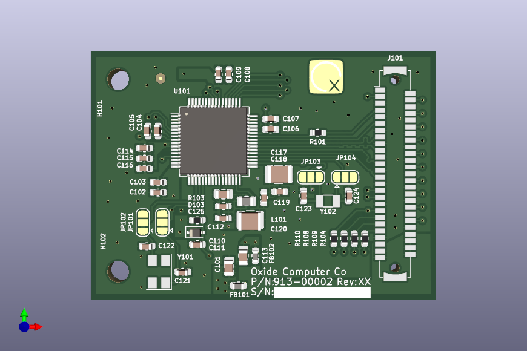
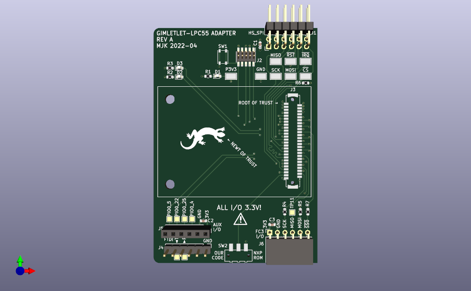

# hw-lpc55-carrier
Daughterboard which plugs into the Gemini Bringup Board (and gimletlet's carrier-carrier) and provides an LPC55 (root of trust microcontroller)

# Bonus Boards

In order to interface with a gimletlet, the LPC55Carrier-Carrier

